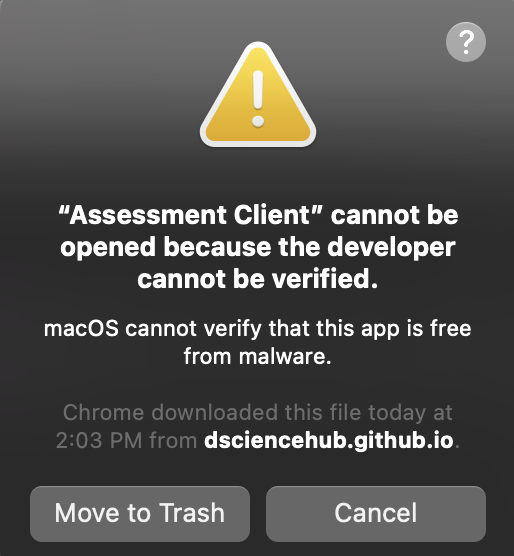
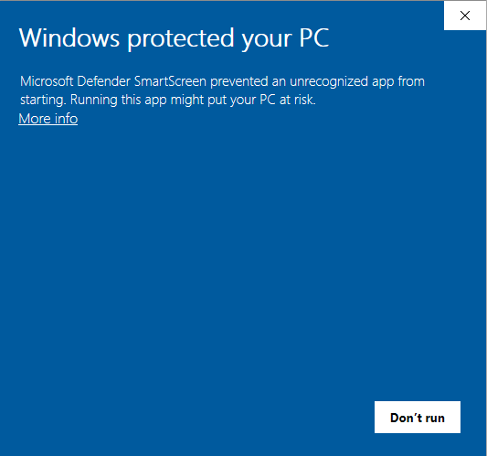
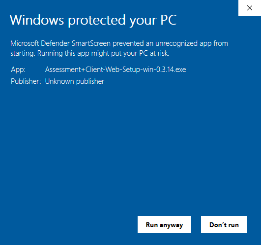

# General

## How do I report an error?
From the application menu select Help > Report Issue

## How do I submit feedback?
From the application menu select Help > Submit Feedback

## Who views my data?
The data is used in automated systems to improve our models, and the application's ability to detect cheating as well as AI features.
Your data is handled in accordance with ethical research best practices and AUC's rules and regulations.
In instances when necessary, data may be viewed by members of our team with due care and in accordance with research rules.

## Can I try out the application without participating in research?
Yes! From the application menu select Research > Start Demo and choose either 'Research - Offline' or 'Showcase - Offline' option for a disconnected demo.
Please be aware that automatic error reporting remains active. The only data that will be communicated to us is diagnostic error data in case you encounter any.

# MacOS

## Application cannot be opened because the developer cannot be verified
This warning appears as our Mac client is not yet signed and certified by Apple as it is experimental software.
To allow running on your device go to System Preferences > Security & Privacy > Click 'Open Anyway'.
For more information about this warning see [Apple Support](https://support.apple.com/en-us/HT202491)

# Windows

## Windows protected your PC error when installing
This warning is due to the fact that our application has not yet been certified by Microsoft as it is still experimental.
To allow the application to install, click the 'More Info' link in the dialog then click the 'Run Anyway' button

# Linux

## Is my distro supported?
The application is distributed as a portable and self-contained AppImage and should run on most major distributions.
It has been tested and is known to work on Debian, Fedora, Arch, Slack and their derivatives.
Check [AppImage FAQ](https://docs.appimage.org/user-guide/faq.html) for more information.

## Application won't start
Please make sure to make the AppImage executable using GUI properties or 'chmod a+x <filename>' from terminal.
